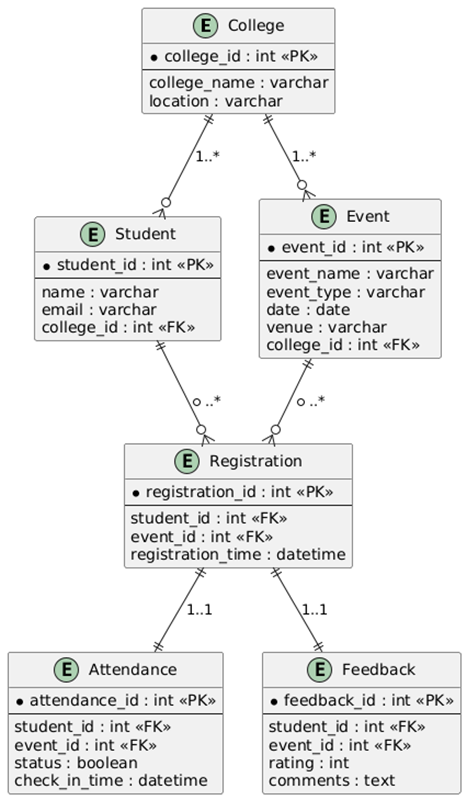
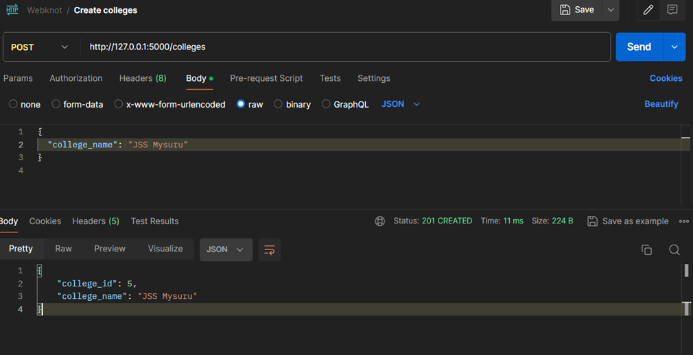

# Campus Event Reporting System
    

## About This Project
This project is a Campus Event Management System that helps colleges create and manage events while allowing students to register and participate easily. The system has two parts:
•	Admin side for staff to add events.
•	Student side for browsing, registering, attendance, and feedback.
The main goal is to provide basic event reports such as total registrations, attendance percentage, and average feedback. It also supports reports like event popularity and student participation. The project is built to handle multiple colleges and a large number of students in a simple and scalable way.

I built it using **Flask (Python)** and **SQLite** for the database. I tested all the APIs using **Postman**.  
It’s not a full-fledged app with a front-end, but it works like a prototype to show how the backend and database flow together.

---

## How to Run It

### 1. Clone the repo
```bash
git clone 
cd campus_event_system
```

### 2. Create a Virtual Environment (Windows)
```bash
python -m venv venv
venv\Scripts\activate
```

### 3. Install Required Packages
```bash
pip install flask flask_sqlalchemy sqlalchemy
```

### 4. Start the Server
```bash
python app.py
```
### 5. Please also check that your system has 
python , SQlite 

Now open Postman and use the APIs at:

```
http://127.0.0.1:5000
```

---

## Database Setup
I kept it simple with 4 tables:

* **colleges** → list of colleges
* **students** → students linked to a college
* **events** → events created by colleges
* **registrations** → which students registered for which events (also tracks attendance + feedback)

**ER Diagram:**  


## API Endpoints

### College & Students
* `POST /colleges` → Add a new college
* `POST /students` → Add a new student
* `GET /students` → Get all students with their IDs

### Events
* `POST /events` → Create a new event

### Registrations
* `POST /register`

  **Single student:**
  ```json
  { "student_id": 1, "event_id": 1 }
  ```
  
  **Multiple students:**
  ```json
  [
    { "student_id": 1, "event_id": 1 },
    { "student_id": 2, "event_id": 1 }
  ]
  ```

### Attendance & Feedback
* `POST /attendance` → Mark attendance for a student
* `POST /feedback` → Submit a rating (1–5)

### Reports
* `GET /reports/popularity` → Most popular events by registration
* `GET /reports/participation` → Events attended by each student
* `GET /reports/top-students` → Top 3 active students
* `GET /reports/attendance-percentage` → Attendance % per event
* `GET /reports/avg-feedback` → Average feedback rating per event

---

## Sample Output


Example – Popularity Report:
```json
[
  { "event_id": 1, "event_name": "Hackathon 2025", "registrations": 2 }
]
```

---

## Notes
* Built and tested on Python 3.11
* Uses local SQLite (`events.db`)
* Prototype backend only – no front-end

---

## Author
**Kshitij Kumar**  
7th Semester CSE Student, Acharya Institute of Technology  

This project helped me understand connecting Flask with a database, handling routes, and writing raw SQL queries. Testing on Postman made me see the flow of APIs clearly. It was a good hands-on experience for learning backend stuff.

## ChatGPT link
**https://chatgpt.com/share/68bb384e-a838-8000-9136-765d56a4b850**